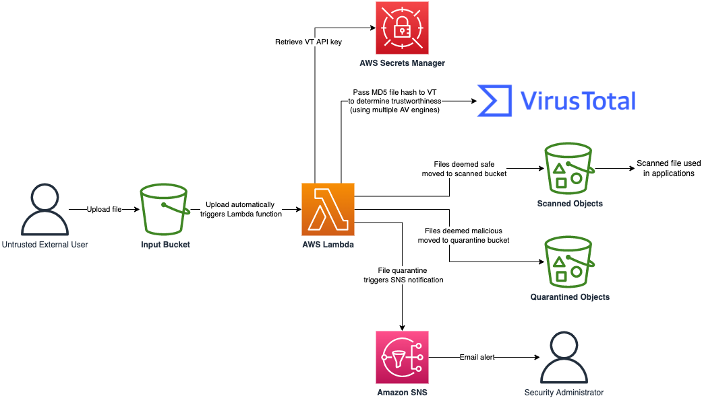

# Amazon S3 Malware Scanning using VirusTotal
When external users upload content to Amazon S3 (e.g. via a file upload portal), that content cannot be trusted and may need to be scanned for malware before it is consumed by applications.

This pattern is a fully serverless, cloud native, solution to the challenge of scanning unknown objects in Amazon S3. Written as a Terraform module, this pattern uses the VirusTotal API to automatically scan new files in Amazon S3 against 70 different malware engines. If a file is deemed malicious, it is quarantined and a notification is sent to security administrators.



## Requirements:

1. An API key from VirusTotal.com *(the Free Public key is limited to 4 lookups/minute, 500/day, 15000/month)*

## How it Works:

The module creates three Amazon S3 buckets. When an object is uploaded to the _input bucket_, its `ETag` is passed to VirusTotal (VT) by an AWS Lambda function, using the API key stored in AWS Secrets Manager.
In most cases, the `ETag` equals the MD5 hash of the file (see the 'Cons' section below for more on this.)
VT will then report back whether the hash matches a file in its database and, if so, how many of its various anti-malware engines report the file as malicious.
If the number of engines reporting the file as malicious reaches a threshold (3 by default, set as a Terraform variable),
then the file will be moved to a _quarantine bucket_.
If not, i.e. if the ETag was not recognised by VT or if the file did not meet the malicious threshold,
then the file will be moved to a _scanned bucket_.

When a file is quarantined, the AWS Lambda function publishes a notification to an Amazon SNS topic.

## Benefits
1. Fast, serverless, lightweight and much cheaper than solutions that require Amazon EC2 sandboxes to be built.
2. Uses results from 70 different anti-malware engines to determine if the file is malicious or not, so not determined by a single vendor.

## Limitations
1. Anti-virus products are only as good as the signatures in the database. This is no different: it's a hash comparison only, so anything that's not already seen by VT could be missed. There is no execution or sandbox (hence the lower cost and speed). But considering Defence in Depth, this would still be a useful additional layer of anti-malware protection if you require untrusted objects to be uploaded to Amazon S3.
2. There are some restrictions/limits on the use of the VirusTotal API. Double check these and decide if you need a pro subscription or whether you could use the free version.
3. This only works for objects where the Amazon S3 `ETag` is equal to the MD5 hash of the contents of the object. In particular,
the following objects will not be accurately scanned by this tool
(see the [Amazon S3 documentation](https://docs.aws.amazon.com/AmazonS3/latest/API/API_Object.html) for more details):
- Objects encrypted with customer owned AWS KMS keys (SSE-KMS) as opposed to encrypted by Amazon S3 managed keys (SSE-S3)
- Objects created by a Multipart Upload. 

## Deployment Instructions
1. Create a file `s3.tfbackend` at the root of this module that specifies where the Terraform state should be stored. Your file must contain at least the following contents (there are other settings you may choose, such as a DynamoDB table for state locking, see the [Terraform documentation](https://developer.hashicorp.com/terraform/language/settings/backends/s3)): 
```
bucket = "YOUR_BUCKET_NAME_HERE"
key    = "YOUR_OBJECT_KEY_HERE"
region = "YOUR_REGION_HERE"
```

2. Add your VT API key to `terraform.tfvars` so that it can be stored in Secrets Manager. If you wish to receive email alerts when an object is quarantined, uncomment the associated lines in `terraform.tfvars` and add in your email address.

3. With AWS credentials configured for your intended deployment environment, run 
```
terraform init -backend-config=s3.tfbackend
```
to initialise Terraform, then
```
terraform apply
```
to see which resources will be created, followed by `yes` (when prompted, if you're happy with the plan) to create those resources.
If you chose to receive email alerts when an object is quarantined, you will need to confirm your Amazon SNS subscription by clicking the link sent to your email address.

## Testing

Upload any file to the S3 bucket `input-bucket-[RANDOM_WORDS]` to confirm that it is processed by AWS Lambda
and moved to either `scanned-objects-[RANDOM_WORDS]` or `quarantined-objects-[RANDOM_WORDS]`
depending on the response from VirusTotal.

If you wish to test with a safe test file that VirusTotal identifies as malicious, one is available at https://www.eicar.org/download-anti-malware-testfile/.
But please note that downloading this test file may trigger alerts on your local machine!
 
## Tear Down
Note that you must empty all your Amazon S3 buckets before they can be destroyed by Terraform.
With AWS credentials configured for your deployment environment, run
```
terraform destroy
```
to see which resources will be destroyed, followed by `yes` (when prompted, if you're happy with the plan) to destroy those resources.


## Planned Updates
1. Refactor the AWS Lambda function as a Step Functions State Machine for all the AWS service integrations (Amazon S3, AWS Secrets Manager, Amazon SNS)
2. Create heuristic & on-demand scans

## Security

See [CONTRIBUTING](CONTRIBUTING.md#security-issue-notifications) for more information.

## License

This library is licensed under the MIT-0 License. See the LICENSE file.
